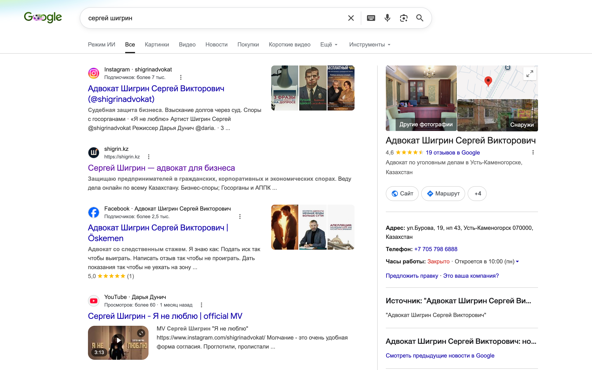
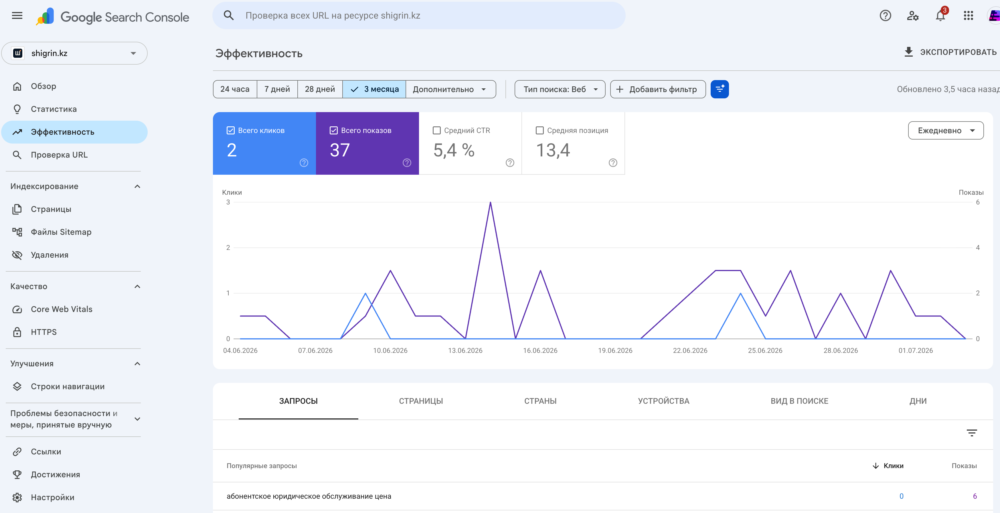
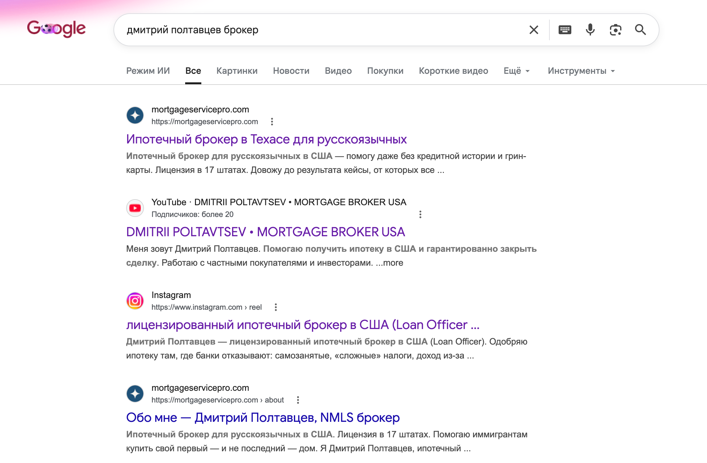
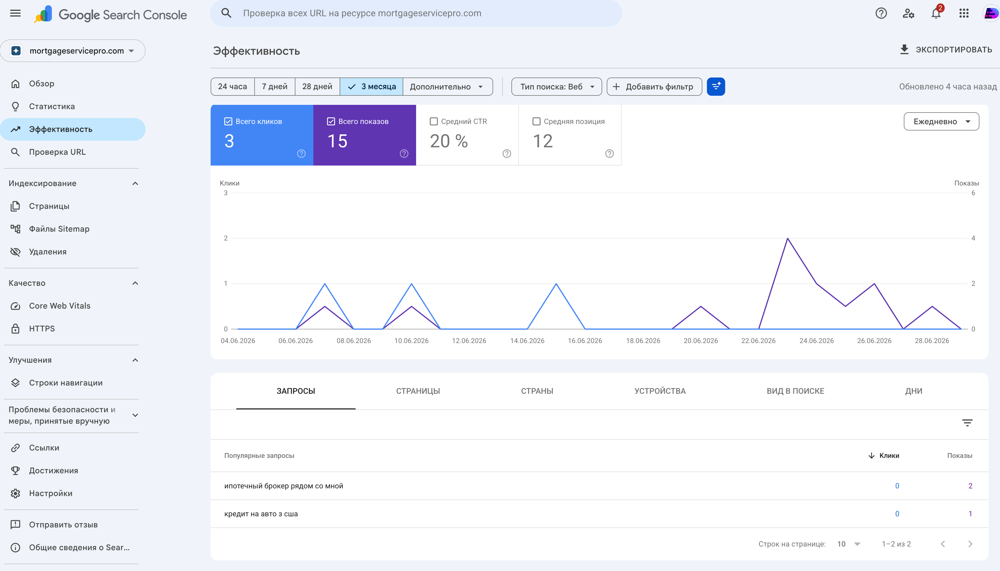

# Сайт shigrin.kz — как работает сайт для адвоката

> Коротко и по-человечески — что внутри сайта и зачем это тебе. Это **не визитка на конструкторе**, а рабочий инструмент, собранный вручную под твою задачу: принимать людей из контента и рекламы, конвертировать их в заявки и годами приносить клиентов из поиска.

---

## Зачем адвокату сайт, а не только соцсети

**Фундамент маркетинга — это грамотный сайт, а не соцсети.** Соцсети — быстрый, но «арендованный» канал: перестал постить или платить — всё закончилось. Сайт — это **твоя собственная система**, в которую сходится весь маркетинг: сюда придёт реклама, здесь работает SEO и копится органика, отсюда заявки, здесь живут страницы под каждое направление защиты. Грамотно сделанный сайт **собирает все каналы в один управляемый механизм** — и остаётся с тобой если не навсегда, то уж точно на годы.

Для адвоката это важнее, чем для кого-либо: твой клиент — предприниматель, который **проверяет, с кем имеет дело**, прежде чем доверить дело на полмиллиарда тенге. Он погуглит. И то, что он найдёт, решает, будет ли звонок. А с онлайн-судопроизводством сайт — это ещё и твой **выход на весь Казахстан** из Усть-Каменогорска: национальная витрина, работающая, пока ты в процессе.

---

## 📊 Коротко: мы против среднего по рынку

**Масштаб.** Сайт — это ~18 страниц: главная, **4 направления защиты** (споры бизнеса, корпоративные, экономические уголовные дела, споры с госорганами) + **абонентское обслуживание**, FAQ, страница **бесплатной консультации** (конверсионный лендинг со страницей «спасибо»), о тебе, контакты, юридический блок, блог.

**Стек.** Написан на **Next.js + React** — это не конструктор и не шаблон, а самый быстрый и современный стек веб-разработки: на нём пишут полноценные приложения и сервисы (Netflix, TikTok, Nike, OpenAI). Для сайта частной практики такой уровень почти не встречается.

Движок блога — **WordPress**. Для работы со статьями он удобнее всего, но у него известная слабость — он тормозной. Мы это починили: WordPress работает только «за кулисами» — как редакция, где пишутся и хранятся статьи. А страницы читателю отдаёт **наш быстрый сайт**: забирает тексты из WordPress и показывает их со своей скоростью. Итог — удобство WordPress без его тормозов.

| Что | Твой сайт | Типичный сайт юрфирмы/частной практики |
|---|---|---|
| Скорость (мобайл) | Lighthouse **96–99** | больше половины сайтов НЕ проходят мобильный тест скорости — [проходят лишь ~48%](https://www.debugbear.com/blog/hardest-core-web-vitals-metric) |
| Технология | **Next.js** — современный серверный рендер | конструктор (Wix/Tilda) или тяжёлый шаблон |
| SEO-разметка | полная (LegalService / Person / FAQ / Article + sitemap) | чаще всего отсутствует |
| GEO (видимость в ИИ-поиске) | машиночитаемый граф сущностей + доступ ИИ-краулерам | почти ни у кого |
| Конверсия | лендинг бесплатной консультации + формы заявок → **заявка сразу в Telegram** | телефон в футере |
| Интеграции | Meta-пиксель + серверный CAPI, Telegram-уведомления, готовность к CRM | никаких |
| Блог | свой движок, статьи твоим голосом | нет или заброшен |
| Сопровождение | мониторинг, авто-деплой, ежедневная проверка заявок | «сделали и забыли» |

---

## ⚡ Скорость и качество — на уровне топовых сайтов

Google оценивает сайты по четырём шкалам **Lighthouse** (от 0 до 100). Зелёная зона — от 90; большинство сайтов малого бизнеса живёт в жёлтой (50–89). Твой сайт на проде — **96–99 по всем четырём шкалам**:

| Шкала | У тебя | Зелёная зона | Среднее по сайтам | Что это значит |
|---|---:|---:|---|---|
| Скорость (Performance) | **96+** | от 90 | лишь **~48%** сайтов проходят порог скорости на мобайле | как быстро сайт открывается на телефоне; самая трудная шкала — именно её большинство заваливает |
| Доступность (Accessibility) | **96+** | от 90 | медиана — **84** | сайтом удобно пользоваться всем: контрасты, шрифты, размеры кнопок |
| Технологии (Best Practices) | **96+** | от 90 | — | код без ошибок и устаревших практик, безопасное соединение |
| SEO | **96+** | от 90 | — | страницы технически готовы к индексации Google |

Средние — [Web Almanac 2024 (HTTP Archive, 16,9 млн сайтов)](https://almanac.httparchive.org/en/2024/accessibility) и [данные по Core Web Vitals](https://www.debugbear.com/blog/hardest-core-web-vitals-metric); по шкалам «Технологии» и «SEO» публичных медиан нет.

**Насколько это важно.** Скорость и доступность — это **база**, самое простое в списке. И именно на ней сыпется абсолютное большинство сайтов: они стоят на дешёвых серверах, конструкторах и тяжёлых движках — а там как ни пыхти, выше 40–50 баллов не выжать. Это **потолок платформы, а не старания**. Твои 96–99 — следствие того, что сайт собран на своём стеке, своей инфраструктуре и прямыми руками: у нас всё ж таки **отдел разработки из 4 программистов + технический директор** — мы свой SaaS пишем.

И это деньги напрямую: скорость — официальный фактор ранжирования Google, медленные сайты опускаются в выдаче, а люди уходят, не дождавшись загрузки.

---

## 🔎 SEO «под капотом» — то, что обычно делают криво, а мы грамотно

Самая невидимая часть сайта — и именно её большинство (даже агентства) делает спустя рукава или не делает вовсе. По-простому, что стоит у тебя и зачем:

- **Мета-теги (title и description)** — заголовок и описание, которые Google показывает под твоей ссылкой в выдаче. От них зависит, **кликнут по тебе или пролистают**. Прописаны для каждой страницы — продуманный человеческий текст, а не «Главная | shigrin.kz».

- **OG-разметка (Open Graph)** — то, как выглядит твоя ссылка, когда её кидают в WhatsApp или Telegram: аккуратная **карточка с картинкой и заголовком**. Для юриста это критично — твои ссылки будут пересылать в чатах предпринимателей.

- **Микроразметка (Schema.org)** — «подписи» в коде, по которым поисковик понимает не текст, а **смысл**: что это **адвокатская практика** (LegalService), кто такой Сергей Шигрин (Person), какие услуги, какие статьи (Article). И отдельный козырь — **размеченный FAQ** (FAQPage): вопросы-ответы, которые Google умеет показывать **прямо в выдаче расширенным блоком** — дополнительное место на экране поверх обычной ссылки.

- **Техническая база:** карта сайта (sitemap), canonical (чтобы Google не путался в дублях), серверный рендер (страницы отдаются поисковику готовым текстом).

**И отдельный пласт — семантическое ядро.** Мы собрали для сайта семантическое ядро — карту запросов, по которым бизнес в Казахстане реально ищет юридическую защиту. Это большая отдельная работа, и сайт сделан **по семантике, а не высосан из пальца**: структура страниц и рубрики блога выросли из этого ядра, а статьи пишутся не «о чём-нибудь полезном», а **по заданию из ядра** — под конкретный запрос, который статья должна закрыть. Это феншуй SEO-продвижения: ровно за эту работу SEO-агентства берут свои деньги, и расчёт там идёт по часам специалиста — **от $50 в час**. И работу ядра уже видно в бою: запрос «абонентское юридическое обслуживание цена» из скриншота выше — он пойман не случайно.

**Почему это важно:** поисковику всё равно, как сайт выглядит для человека — он «читает» именно эти теги. Сделано грамотно → Google понимает тебя и ранжирует выше. Сделано криво (как у большинства) → сайт вроде есть, а в поиске его будто нет.

---

## 📝 Блог — статьи, которые работают годами

Блог — это не «вести соцсети, только на сайте». Это **другой класс актива**, и тут важна разница в горизонтах:

- **Контент в соцсетях — быстрый результат, но только пока его делаешь.** Перестал выпускать — он перестал работать.
- **Статья на сайте — это инвестиция:** один раз написана — и годами ловит людей из поиска. Даже если перестать пополнять блог, написанное продолжает приносить трафик ещё 2–3 года.

Ты сам назвал проект инвестицией в будущее — блог и есть самая буквальная её форма. Каждая статья — это ещё одна «ловушка» в Google под конкретный вопрос предпринимателя. Как это работает, уже видно: страница абонентского обслуживания поймала запрос «абонентское юридическое обслуживание цена» — блог добавит таких ловушек десятки.

И важно, **как** пишутся статьи: не копирайтером «про юриспруденцию вообще». Темы — из реальных вопросов твоих клиентов и твоей практики, а текст собирается **твоим голосом**: у нас накоплена база из 35 твоих наговоров и расшифровок — стиль твой, а не «сеошный». Первые статьи уже опубликованы, ещё три готовы и ждут твоей сверки.

---

## 🎯 Конвертирующий слой — страницы, которые превращают посетителя в заявку

Это не «страницы про услуги» — это **конвертирующий слой воронки**: место, где человек, прогретый контентом или пришедший из поиска, превращается в заявку.

И заметь: сайт построен ровно по принципу, о котором ты говоришь, — **герой здесь клиент, а не адвокат**:

- **Каждая страница — про боль клиента, а не про регалии**: налоговая проверка, спор с контрагентом, уголовное дело по бизнесу, конфликт с госорганом. Человек попадает на страницу **ровно про свою ситуацию**, а не на общую «главную».
- **FAQ — это вопросы клиента его словами**, а не «о нашей практике».
- **Лендинг бесплатной консультации** с формой и страницей «спасибо» — низкий порог первого шага для клиента: не «нанять адвоката», а «разобрать мою ситуацию».
- Цепочка простая: контент/поиск → страница про его боль → заявка → ты.

**И это уже работает — по двум фронтам.**

Сайт проиндексировался и по запросу «Сергей Шигрин» уже стоит на **2-й строчке Google** — сразу после твоего Instagram. И обрати внимание, как выглядит ссылка в выдаче: «Сергей Шигрин — адвокат для бизнеса. Защищаю предпринимателей… Веду дела онлайн по всему Казахстану» — это те самые мета-теги из раздела выше, работающие в бою:

<i>Google по запросу «сергей шигрин»: shigrin.kz — 2-е место, с продуманным заголовком и описанием.</i>

Дальше — Google Search Console: сайт уже собирает показы **по целевым коммерческим запросам**. Первый пойманный — **«абонентское юридическое обслуживание цена»**: человек ищет цену услуги прямо сейчас, и Google показывает ему твою страницу абонентского обслуживания. За период: 37 показов, средняя позиция 13,4 — для сайта возрастом в пару месяцев без рекламы это очень ранний и очень хороший сигнал:

<i>Google Search Console, shigrin.kz: показы и клики из органического поиска; топ-запрос — «абонентское юридическое обслуживание цена».</i>

**А 30 июня с сайта пришла первая заявка** (я передал её тебе 3 июля) — предприниматель из Усть-Каменогорска, спор между юрлицами по договору на руднике. Ровно целевой профиль. И это при том, что рекламу на сайт мы ещё **не включали** — только органика.

---

## 📊 Аналитика и пиксель — топливо для рекламы

В сайт встроена рекламная аналитика **по-взрослому, а не «код на страницу и забыли»** — она включается вместе с рекламным этапом. Что в связке:

**Meta-пиксель + серверный Conversions API + дедупликация событий.** Кроме браузерного пикселя события о заявках уходят в Мету и с сервера, каждое помечается общим ID, чтобы не посчиталось дважды. Зачем: события долетают до рекламной системы, **даже когда браузерный пиксель режут** — iOS, блокировщики рекламы, отклонённые cookie. Большинство ставит один пиксель и молча теряет часть конверсий.

**А главное — обучение алгоритма.** Реклама оптимизируется по тем событиям, которые до неё дошли: меньше событий → алгоритм учится на неполных данных → лид дороже. Полный сигнал (пиксель + сервер) = алгоритм умнеет и сам приводит более целевых людей.

**Итог всей конструкции — оптимизация по качественному лиду.** Когда заявки идут через сайт, реклама учится не на кликах и просмотрах, а на **людях, которые реально дошли до заявки**, — и ищет похожих именно на них. Это и есть то, за что платят в рекламе: не трафик, а качественные заявки — и дешевле.

---

## 🔒 Надёжность и своя инфраструктура

- Свой сервер на **Hetzner** — немецкий хостинг, **лучшее в мире соотношение надёжности и цены**: индустриальный эталон. Плюс строгий SSL и **авто-деплой** — обновления выкатываются автоматически и без простоя.
- **Ежедневный мониторинг заявок**: каждая заявка с формы проверяется и передаётся тебе — ничего не теряется.
- Всё под нашим контролем — сайт не «отвалится» и не зависит от прихотей конструктора.

**Плюс распределённая сеть кэширования (Cloudflare CDN).** Сервер физически стоит в Германии, а твоя аудитория — в Казахстане, и каждый запрос через полконтинента — это задержка. CDN решает это так: копии страниц хранятся на узлах Cloudflare по всему миру, и человек из Алматы получает сайт с узла рядом с собой, а не из Франкфурта.

Тонкость в том, что обычно CDN просто «включают галочкой» — и получают больше проблем, чем пользы: посетителям отдаются устаревшие страницы (обновил условия — а люди неделями видят старые), ломаются формы и аналитика. Поэтому у многих кэш формально включён, но либо не работает, либо вредит.

Мы делаем это управляемо: DNS сайта уже переведён на Cloudflare, а кэширование включаем **настроенным** — что кэшировать, что трогать нельзя (формы, заявки) и как кэш автоматически сбрасывается при каждом обновлении сайта. Итог: сайт летает в Казахстане, хотя сервер — в Европе.

---

## 📈 Как это работает у других наших клиентов — живые кейсы

Твой сайт собран на той же платформе, что сайт нашего клиента — **ипотечного брокера в США** (ниша с бешеной конкуренцией). Его сайт мы запустили в начале июня — вот что произошло за первые недели, **без единого доллара на рекламу сайта**:

**1. Сайт вышел в топ Google по имени — выше его собственных соцсетей:**

<i>Google по запросу «Дмитрий Полтавцев брокер»: сайт — на 1-м месте, выше YouTube и Instagram.</i>

**2. И начал собирать показы и клики по целевым коммерческим запросам** — первый пойманный запрос: «ипотечный брокер рядом со мной». 15 показов, 3 клика, **CTR 20%, средняя позиция 12** — это холодные люди из поиска, которые ищут услугу прямо сейчас:

<i>Google Search Console: органические показы, клики и целевой запрос — сайту меньше месяца.</i>

И второй кейс — совсем близкий тебе по нише. **Павел Осинский, адвокат в Варшаве** (коммерческое право + защита по экономическим уголовным делам — практически твой профиль): [osinski-legal.pl](https://osinski-legal.pl/pl). У него в блоге ~20 статей на польском — и **клиенты приходят именно с них**: блог годами работает его входящим каналом из Google, без рекламы. Ровно та модель, что заложена тебе в разделе про блог, — только у тебя она собрана на технике поновее.

<i>osinski-legal.pl: адвокат по коммерческому и экономическому уголовному праву, Варшава — блог этого сайта стабильно приводит клиентов.</i>

Это механика, а не везение: быстрый сайт + грамотная разметка + правильная структура → Google начинает приводить людей сам. У тебя стоит **та же машина** — и первая заявка уже пришла.

---

## 💼 Предложение: довести машину до конца

Где мы находимся по методологии. Мы всегда действуем по одному плану: **гипотезы → тестирование → под проверенные гипотезы строится посадка (сайт, лендинги) → закрывающие кампании**. С тобой мы прошли почти весь путь: гипотезы протестированы, аудитория собрана (~1400 подписчиков по ~$0,27, вовлечённость до 62%), сайт построен и уже проиндексировался. Осталась **финальная часть — включить лидген**. База создана — реклама на неё не запущена.

**Доводка (~1–1,5 месяца):**
- докручиваем сайт до образцово-показательного адвокатского: аналитика, интеграции, Telegram-уведомления о заявках, контент в блог (три статьи уже готовы к твоей сверке);
- включаем **Cloudflare CDN** (финальный настроенный шаг — раздел про инфраструктуру выше) и **боевой пиксель с аналитикой** (связка описана выше — встаёт за минуты);
- **GEO — оптимизация под ИИ-поиск** (ChatGPT, Perplexity): машиночитаемый граф сущностей у тебя уже размечен (LegalService, FAQ) — открываем доступ ИИ-краулерам, чтобы ассистенты знали сайт и ссылались на него в ответах;
- лендинги под **проверенные** гипотезы;
- записываем несколько **закрывающих** видео (не прогревочных) — по нашим сценариям;
- запускаем лидген-кампании: тестируем группы, смотрим цену лида.

**Поддержка после (система в рабочем виде):**
- 4 видео в месяц: 2 — на широкую аудиторию (факты, «Допрос и право»), 2 — точно по гипотезам и сценариям; плюс карусели;
- лонгриды на сайт — индексация растёт; контроль SEO;
- **механика по требованию:** нужны клиенты → добавляем $100–200 в лидген → заявки идут из тёплой базы, которая копилась всё это время. Не нужны — машина работает на минималках и копит актив.

**Опция под твою загрузку — ИИ-ассистент на заявки.** Ты сказал, что завален работой, — ровно для этого: бот первым отвечает на заявку, подогревает и **квалифицирует** лида, а к тебе попадает уже готовый к разговору человек. «Лид написал, а мне некогда» — снимается.

И перспектива на вырост — **ИИ-агент для обновления сайта**: пишешь обычными словами, что поменять (услугу, цену, факт из практики), — и он сам переписывает страницу, не ломая ни дизайн, ни SEO. Мы внедряем это на зрелых сайтах — в малом бизнесе так почти никто не делает.

**Условия.** Продолжаем на тех же условиях. Для понимания контекста: один только такой сайт на рынке стоит минимум **$3–4k** — по качеству, объёму и вовлечённости близкого предложения за эти деньги ты не найдёшь. Почему так: я открыто говорил — мне нужен **доведённый до результата адвокатский кейс**, твой проект успешен, и бросить его на последнем шаге жалко и мне, и, думаю, тебе.

### Что нужно от тебя, чтобы стартовать

**Добро по работе и оплате — и продолжаем.**

---

**Итог:** это **актив, который остаётся с тобой** и работает на два фронта — конвертирует внимание в заявки и сам приводит людей из поиска. Ты назвал проект инвестицией в будущее — так и есть, и инвестиция уже сделана: осталось запустить последний узел машины и посмотреть на целевые лиды. На том же шаблоне (см. кейс выше) этот узел уже работает.
